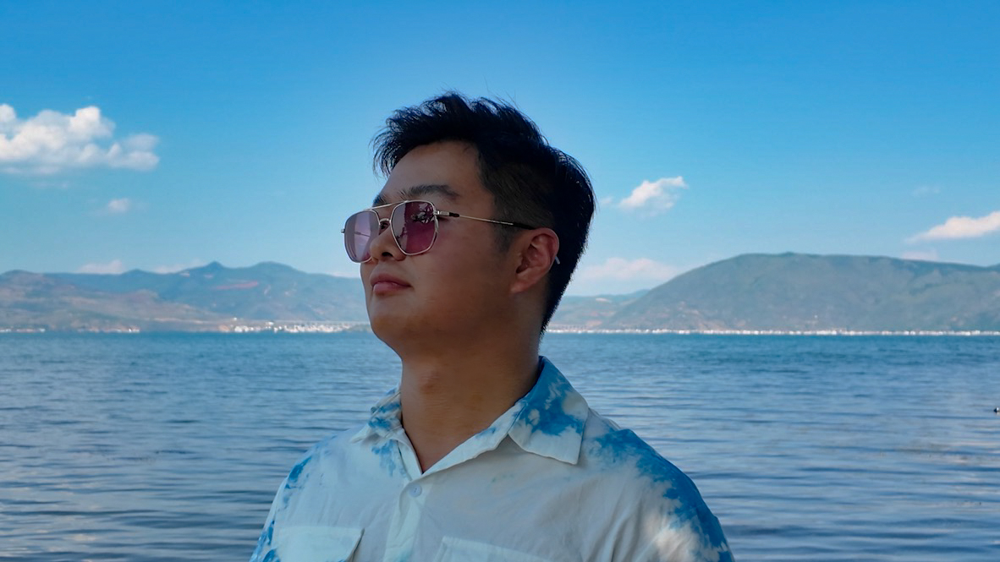

# About Me

**Qianyi Shen (Ethan, 沈谦逸)**. 

- Ph.D. Student, Institute of Intelligent Vehicles, [Tongji University](https://www.tongji.edu.cn/) (IIV-TJ)
- Supervisor: [Prof. Jie Chen](https://see.tongji.edu.cn/info/1369/10791.htm)
  - Academician of Chinese Academy of Engineering
  - IEEE Fellow
  - Party Secretary, Harbin Institute of Technology
  - Former Vice Minister, Ministry of Education, P.R. China
  - Former President of Tongji University
- Email: [qy.shen@outlook.com](mailto:qy.shen@outlook.com), [RichestShen@Gmail.com](mailto:RichestShen@Gmail.com)
- Tel & WeChat: +86 166 0189 0644
- ORCID: 0009-0008-0746-3135

---

## Research Interests

- SLAM && CO-SLAM, especially in off-road scenarios
- Autonomous Driving
- High-Performance vehicles
- to be discovered ...

---

## Biography
### Education
- 2021.09-2025.06, B.Eng., [School of IOT Engineering](https://iot.jiangnan.edu.cn/), [Jiangnan University](https://www.jiangnan.edu.cn/), Wuxi, China.
  - Supervisor: [Prof. Ziyun Wang](https://iot.jiangnan.edu.cn/info/1142/3583.htm), [Prof. Yan Wang](https://iot.jiangnan.edu.cn/info/1141/3534.htm)
  - 2022.06-2025.06, Member of [Honors School](https://honorschool.jiangnan.edu.cn/) (Selected from the top 5% students at Jiangnan University)
- 2025.09- , Ph.D. student, [College of Electronics and Information Engineering](https://see.tongji.edu.cn/), [Tongji University](https://www.tongji.edu.cn/), Shanghai, China.
  - Supervisor: [Prof. Jie Chen](https://see.tongji.edu.cn/info/1369/10791.htm) (Academician of CAE, IEEE Fellow)

---

## Personal Info
Qianyi Shen, also known as Ethan Shen, was born in Yancheng City, Jiangsu Province, China. He is currently pursuing his Ph.D. at Tongji University in Shanghai under the supervision of Prof. Jie Chen (Academician of Chinese Academy of Engineering, IEEE Fellow). He is a member of the Institute of Intelligent Vehicles at Tongji University (IIV-TJ). He obtained his B.Eng. from the School of IoT Engineering at Jiangnan University in Wuxi, China. As an enthusiastic car enthusiast and a devoted Formula One fan, his personal interests are now closely aligned with his academic pursuits. His research focuses on SLAM (Simultaneous Localization and Mapping), autonomous driving, and high-performance vehicles.

 